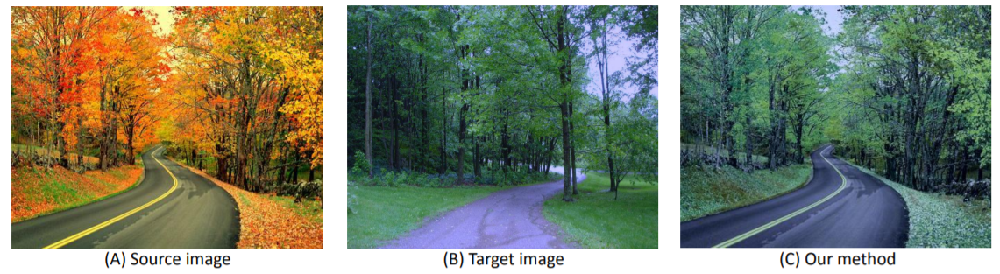

# Illuminant-Aware-Gamut-Based-Color-Transfer

This is a python implementation of Illuminant Aware Gamut-Based Color Transfer in Computer Graphics Forum 2014[Paper](http://www.cse.yorku.ca/~mbrown/pdf/cgf2014_color_transfer.pdf)<br/>.

This paper provides a color transfer method that only changes the source image's color without modifying the appereance. Figure below shows how it looks like.


## Setup

### Requirement
Required python (version 3.6) libraries: Opencv-python + Scipy + Numpy.

Tested in Windows10 and Ubuntu 16.04

### Testing
1. Clone this repository.
2. Modify the input images name in demo.py if you need
```Shell
python demo.py
```

## Citation
If you use our code  for research, please this paper:

This is a python implementation of Illuminant Aware Gamut-Based Color Transfer in Computer Graphics Forum 2014

### License
MIT License.

## Questions
If you have additional questions after reading the FAQ, please email to runshengxu2017@u.northwestern.edu
